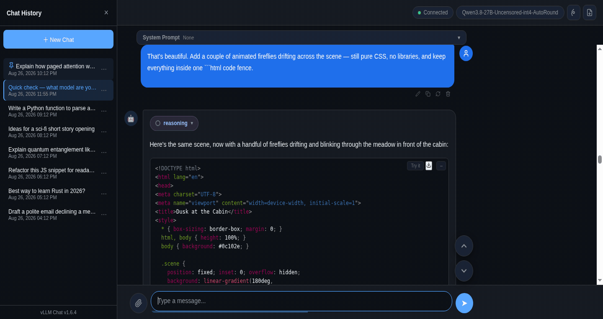

# vLLM Chat



A llama.cpp-style chat window for [vLLM](https://github.com/vllm-project/vllm)'s OpenAI-compatible API. Single-file HTML frontend + a tiny Python static server. Built to run locally against your own vLLM instance.

## Features

- **Streaming chat** with a live stats bar per response: tokens / time / tok/s (llama.cpp's exact cumulative formula `predicted_n / predicted_ms * 1000`), plus the serving model badge — the stats row is a theme-aware plate attached to the response bubble (bottom-rounded, matches the bubble color) so it stays readable over video/image chat backgrounds
- **Thinking pill** — collapsible "reasoning" block for models that emit `delta.reasoning` (pair with vLLM's `--reasoning-parser qwen3`)
- **Markdown + code blocks** — GFM via marked.js, syntax highlighting via Prism, Copy / Try-it / Download buttons on code blocks, and a llama.cpp-style sandboxed HTML preview for generated HTML
- **Attachments** — images (sent as OpenAI vision parts), plus txt/csv/json/md/pdf/xlsx/xls/docx (server-side text extraction via `/api/extract`)
- **Unlimited output** — no token cap; truncation is detected and flagged when vLLM stops at `finish_reason: length`
- **Per-thread system prompts** — each conversation carries its own prompt, new chats inherit the last known one
- **Message actions** — copy, recycle (re-run the prompt), delete (bubble + everything below)
- **Jump buttons** — floating up/down chevrons to walk between messages
- **Token context bar** — Big AGI-style segmented bar at the input's bottom edge (history / current message / max response, red on overflow); hover pops the exact context breakdown: model max tokens, this message, history, max response
- **History** — sidebar with localStorage persistence, thread titles, per-thread model badges, slim theme-aware scrollbars (sidebar, chat area, code blocks, thinking panels), and the panel open by default (your last open/closed choice still wins after you've set it); the currently open conversation is highlighted in the list (theme-aware accent rail + tint)
- **Sidebar pin** — a panel icon next to the Chat History header keeps the chat-history panel open while you switch conversations (chat select and outside-click no longer auto-close it); click again for normal auto-close behavior, and both the pin choice and the panel's open/closed state persist across reloads
- **Thread menu** — ⋯ menu on every conversation: rename (custom title that survives saves), pin (favorites float to the top with a pin glyph), export the thread as JSON, or delete
- **JSON export / import** — export one chat or many as structured JSON (header button = current chat, thread menu = that chat, sidebar footer buttons = bulk export with per-chat checkboxes / import). Imports merge by id: new chats are added, existing ids are replaced in place; the same 4.5 MB storage guard used by saves keeps attachment payloads from blowing the quota
- **Edit messages** — ✎ on user messages: edit an old prompt and re-send; if a response existed, the old answer is kept and a ‹ n/N › pill flips between versions (llama.cpp/Qwen style, persists across reloads)
- **Themes** — ten two-color themes in the settings modal, grouped as Dark and Light (Blue, Green, Purple, Orange, Teal each in a dark and a light variant): a single click re-themes the whole UI instantly and your choice persists across reloads
- **Background streaming** — start a response, then browse any other chat: the render keeps running in the background and lands in the thread that started it (the chat you're reading is never touched, no scroll-jacking); return mid-render and the live bubble picks the stream back up; Stop keeps the partial output
- **Chat background** — settings → Chat Background: a local image, an image URL, a YouTube video or playlist (muted autoplay with a bottom-right unmute button; captions are forced off), or a color with a transparency slider; an optional overlay with two crossfading colors and its own transparency sits over any background, and the chat area shows the background nearly clean while the header/sidebar/input keep a light frost so messages stay readable
- **Chat search** — a search box under the + New Chat button: typing live-filters the chat list by title (case-insensitive; pinned chats still float to the top); pressing Enter searches inside the actual chat messages and lists every chat containing the word or phrase (title matches stay in the results too)

## Run

```bash
python3 chat-server.py        # serves http://localhost:3001
```

Requires Python 3. For attachment extraction of PDF/XLSX/XLS/DOCX, install the extras once:

```bash
pip install --user --break-system-packages pypdf openpyxl xlrd python-docx
```

The page connects to `http://localhost:8000` (`API_URL` in `index.html`) — point it at your vLLM server. The chat client is front-end only; it never launches or kills the model server.

## Structure

```
index.html        # the whole UI — all CSS/JS inline, marked.js + Prism embedded
chat-server.py    # static file server + /api/extract (attachments)
launch.sh         # convenience launcher (starts server, opens browser)
favicon-*.png     # icons
```

## License

MIT
