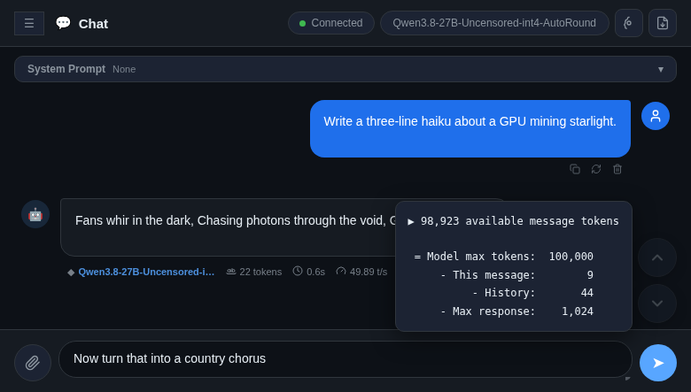

# vLLM Chat



A llama.cpp-style chat window for [vLLM](https://github.com/vllm-project/vllm)'s OpenAI-compatible API. Single-file HTML frontend + a tiny Python static server. Built to run locally against your own vLLM instance.

## Features

- **Streaming chat** with a live stats bar per response: tokens / time / tok/s (llama.cpp's exact cumulative formula `predicted_n / predicted_ms * 1000`), plus the serving model badge
- **Thinking pill** — collapsible "reasoning" block for models that emit `delta.reasoning` (pair with vLLM's `--reasoning-parser qwen3`)
- **Markdown + code blocks** — GFM via marked.js, syntax highlighting via Prism, Copy / Try-it / Download buttons on code blocks, and a llama.cpp-style sandboxed HTML preview for generated HTML
- **Attachments** — images (sent as OpenAI vision parts), plus txt/csv/json/md/pdf/xlsx/xls/docx (server-side text extraction via `/api/extract`)
- **Unlimited output** — no token cap; truncation is detected and flagged when vLLM stops at `finish_reason: length`
- **Per-thread system prompts** — each conversation carries its own prompt, new chats inherit the last known one
- **Message actions** — copy, recycle (re-run the prompt), delete (bubble + everything below)
- **Jump buttons** — floating up/down chevrons to walk between messages
- **Token context bar** — Big AGI-style segmented bar at the input's bottom edge (history / current message / max response, red on overflow); hover pops the exact context breakdown: model max tokens, this message, history, max response
- **History** — sidebar with localStorage persistence, thread titles, per-thread model badges
- **Thread menu** — ⋯ menu on every conversation: pin (favorites float to the top with a pin glyph), export the thread as a .txt, or delete

## Run

```bash
python3 chat-server.py        # serves http://localhost:3001
```

Requires Python 3. For attachment extraction of PDF/XLSX/XLS/DOCX, install the extras once:

```bash
pip install --user --break-system-packages pypdf openpyxl xlrd python-docx
```

The page connects to `http://localhost:8000` (`API_URL` in `index.html`) — point it at your vLLM server. The chat client is front-end only; it never launches or kills the model server.

## Structure

```
index.html        # the whole UI — all CSS/JS inline, marked.js + Prism embedded
chat-server.py    # static file server + /api/extract (attachments)
launch.sh         # convenience launcher (starts server, opens browser)
favicon-*.png     # icons
```

## License

MIT
